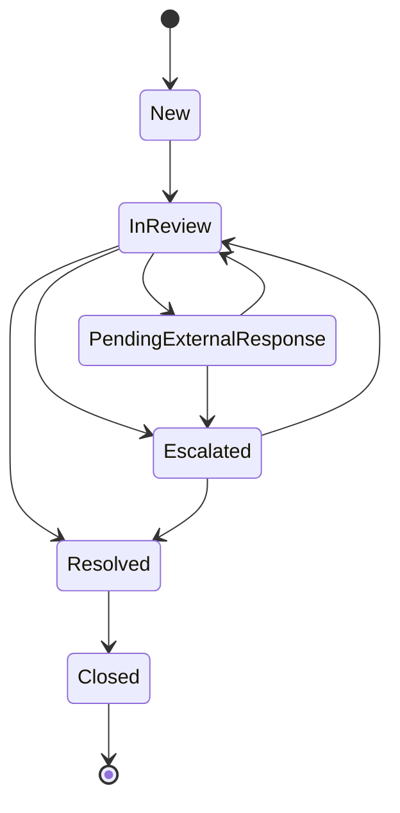

# Payment Exception Status Lifecycle

## Status notes

* A case starts as 'New'.
* Once analyst begins investigation, the case moves to 'In Review'.
* If external input is required, the case moves to 'Pending External Response'.
* If SLA, value, risk, or complexity tresholds are met, the case may move to 'Escalated'.
* A case can only move to 'CLosed' after it has been marked as 'Resolved'.
* Closure requires a valid closure reason.