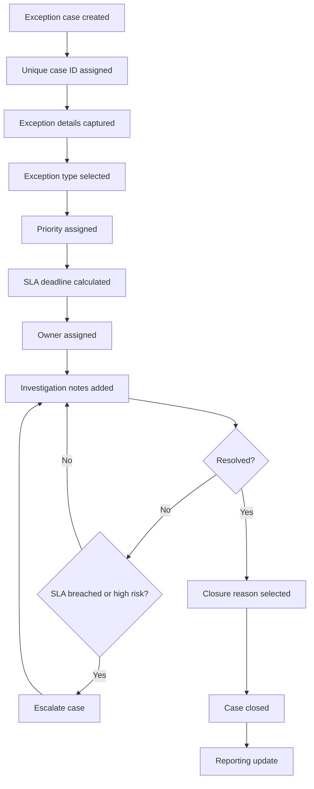

# Target State Process Diagram

## Notes

This diagram represents the proposed target workflow for payment exception handling.

Key improvements:

* each case receives a unique case ID;
* exception details are captured consistently;
* priority and SLA are assigned based on business rules;
* ownership is clear;
* aged and high-risk cases can be escalated;
* closure requires a valid reason;
* reporting is updated from structured case data.

